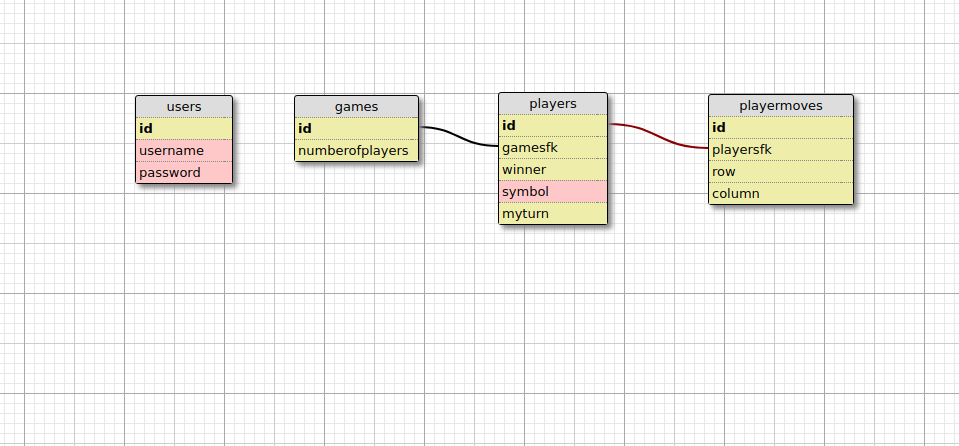

# TicTacToe

### Improvements After Initial Completion
- use bootstrap instead of using your own CSS
- change up the database so that it limits the length of the password and the username because for now it's just accepting any length. 
- refactor app.js and possibly routes/index.js.